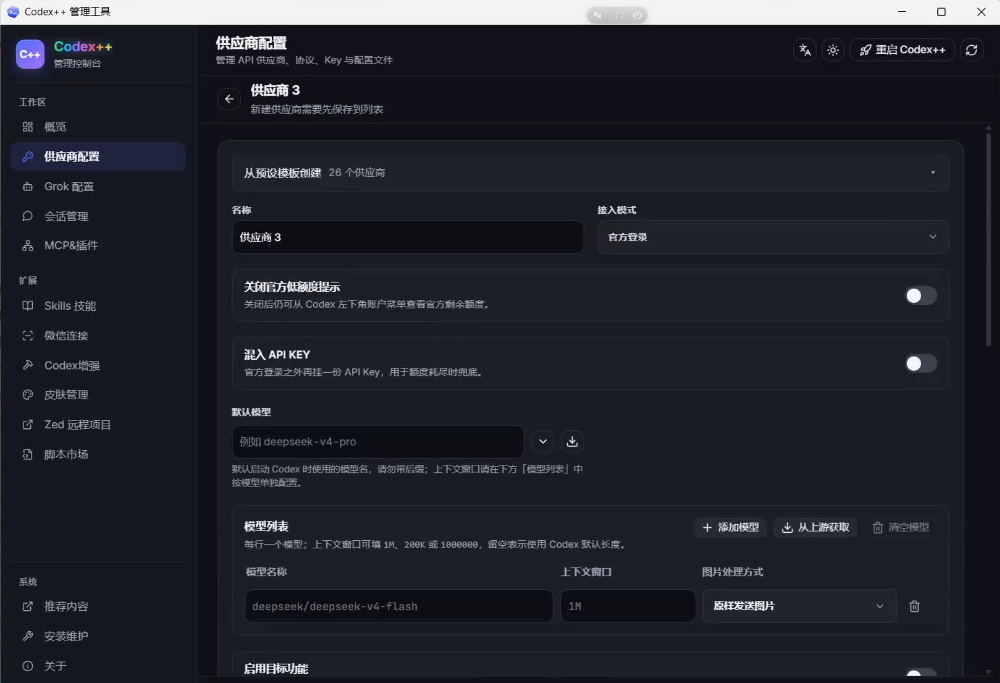
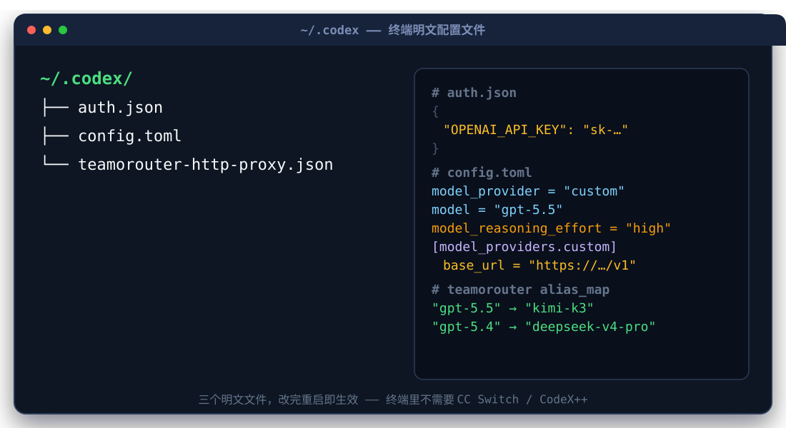
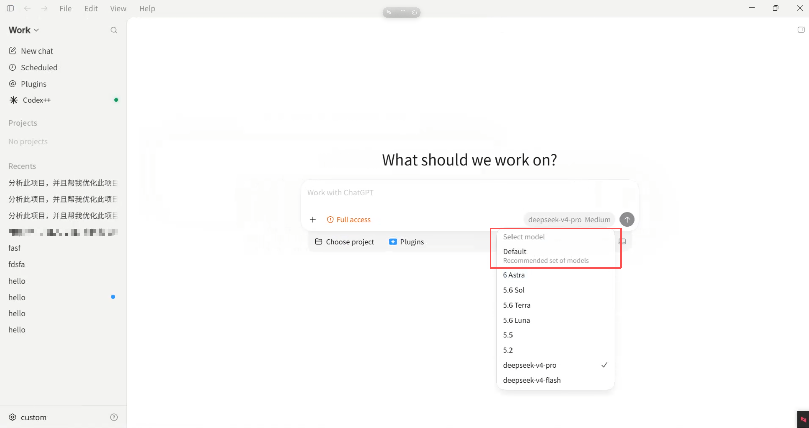
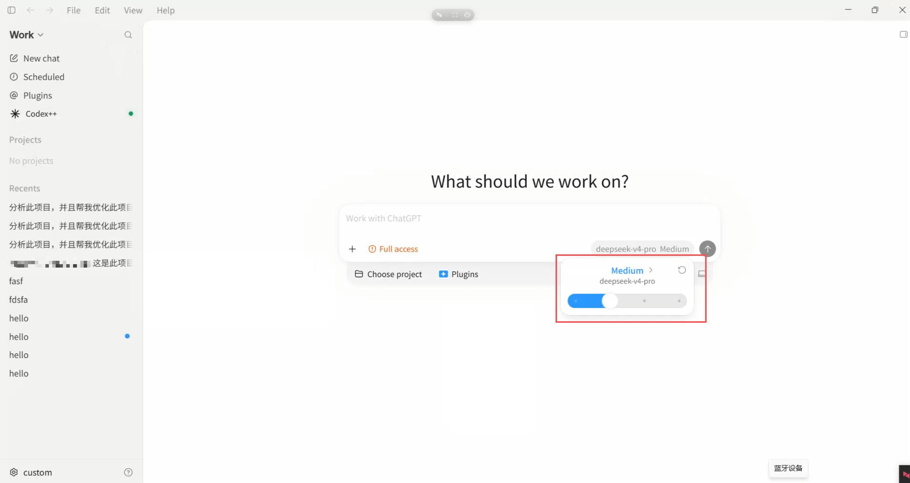

Codex 和 Claude Code，说白了是一类东西：**AI 编程智能体（AI coding agent）**。它们不只是聊天陪你写代码，而是真的能在一个环境里**运行代码**——读文件、跑命令、改代码、执行测试，把结果反馈回来，再接着往下干。区别在于它们背后各有一家大厂：Codex 是 OpenAI 的，Claude Code 是 Anthropic 的，绑定的模型分别是 GPT 和 Claude。

这篇文章讲几件事：它们在不同平台上到底叫什么、各有什么优势；CLI 和 GUI 到底差在哪、为什么我最后回了 CLI；国内怎么把它们用起来（CodeX++ 和 CC Switch）。文末再附一份 CLI、TUI、GUI 三者的完整对比，作为扩展。

## 同一个东西，在不同端有不同的名字

这俩工具是「终端起家」的，后来才往桌面端延伸。所以同一个产品，换个端名字就变了：

| 产品 | 终端端 | 桌面端 |
|---|---|---|
| OpenAI 的 Codex | Code X（Codex） | ChatGPT App |
| Anthropic 的 Claude Code | Claude Code | Claude（桌面 App） |

终端端是它们的原生形态：Codex 在终端里就叫 Code X，Claude 在终端里叫 Claude Code（这个名字后来也成了产品名）。到了桌面端，OpenAI 把 Codex 的能力并进了 ChatGPT App；Anthropic 这边则是 Claude 桌面应用。

也就是说：你在终端里敲的是 Claude Code / Code X，在桌面上用鼠标点开的是 Claude / ChatGPT。背后是同一批模型、同一套「能运行代码」的能力，只是外壳不一样。

这个「终端 vs 桌面」的差别，落到实际操作上，其实就是下面要说的 **CLI 和 GUI** 的差别。

## CLI 和 GUI：先分清这两个

先看最核心的两种形态——一个在终端里敲命令，一个是桌面 App：

- **CLI（Command Line Interface，命令行界面）**：一切都是文本。你敲一行命令，它回一行结果，没有鼠标、没有面板，最纯粹也最轻。
- **GUI（Graphical User Interface，图形用户界面）**：就是桌面 App。窗口、按钮、菜单、拖拽文件，全靠鼠标，所见即所得。

各自的优势也正好对应两种思路：

- **CLI 的优势**：轻。单个进程、几乎没有界面开销，内存和 CPU 占用最低；还能脚本化、管道串联，`command | grep ...` 这种组合拳最顺手，也好做自动化。
- **GUI 的优势**：直观省心。所见即所得，拖文件、点按钮、看通知，上手成本最低，完全不用记命令。

简单说，CLI 偏**轻量**，GUI 偏**直观**，这是两者最根本的差异。

## 我为什么从 GUI 回到 CLI

我最早用的是桌面端（GUI），后来转回了终端（CLI）。这个转变的动机很朴素：**轻量，省内存**。

桌面端用起来是方便，但内存占用是真的高。我的机器是一台 MacBook Air，而这台机器**没有风扇**。桌面端一开，内存和 CPU 占用直接拉满，机身很快就发烫——没有风扇就只能靠外壳散热，摸上去烫手是常态。CPU 一高，又没有风扇，结果就是又烫又卡。

切到终端的 CLI 之后，这个问题基本消失：界面开销没了，内存和 CPU 占用低一大截，机器不再动不动发烫。代价是 CLI 的可视化确实没那么亮，而且**引用文件要自己复制路径**——把路径贴进命令里它才认得。这算是轻量换来的一个小麻烦，我认了。

> 一句话总结：要直观省心选 GUI，要省内存、机器不烫选 CLI。我选了后者，因为无风扇的 MacBook Air 对 GUI 太不友好。

## 国内环境：不能直接登录，得绕一圈

这俩工具在国内的使用环境有一个共同前提：**Codex 和 Claude Code 都不能直接登录**，模型接口和登录鉴权都连不上。

常见的解法是用 **CC Switch** 这类工具做自定义配置——把请求指到国内的模型网关或者兼容接口上，绕开官方的直连。它本质上是个「配置切换器」，帮你管理这些工具该连哪个 baseURL、用哪把 key、默认选哪个模型。

## CodeX++：CodeX 客户端的增强包

如果你用的是 CodeX 客户端，其实还有个更省事的选择：**CodeX++（CodeX 加加）**。

CodeX++ 的定位是给 CodeX 客户端做增强，其中一个功能就是**「添加供应商」**——和 CC Switch 的配置切换是同一套逻辑，把模型和接口的切换都收进来了。装上 CodeX++ 之后，**不需要再单独去装一个 CC Switch**。对于用 CodeX 客户端的人，相当于少折腾一个工具。

## 终端里其实不需要 CC Switch（也不需要 CodeX++）

这是我自己折腾出来的一个体会：**在终端里用这两款工具，根本不需要动用 CC Switch 或 CodeX++ 这类「配置切换器」。**

因为终端版的配置就是一堆明文文件——`auth.json`、`config.toml` 这类。我可以直接跟 AI 说：去改自己的 `auth.json` 或 `config.toml`，把 baseURL、模型、推理强度都配好。AI 能自己读、自己改、再写回去，完事重启一下就能用。

我机器上 `~/.codex/` 里这两个文件，各自分工是这样的：

- `auth.json`：登录鉴权，存的是明文的 `OPENAI_API_KEY`。
- `config.toml`：主配置，`model_provider`、`model`、`model_reasoning_effort`（推理强度）、自定义供应商的 `base_url` 都在这里。

它们长这样（key 和网关地址做了脱敏）：

也就是说，这些明文文件本身就是「兜底」——看得见、改得动，随便哪个 AI 都能帮你改，改完重启就生效。这也正是终端里不需要 CC Switch / CodeX++ 的原因：配置文件直接摆在那，跟 AI 说一声它就能自己改好。

CC Switch / CodeX++ 的价值在**桌面端**更明显：桌面 App 没有这么透明的配置文件让你随手改，或者说改起来要折腾。**如果你不愿意折腾，用 CC Switch（或 CodeX++）确实是不错的选择**——点几下把配置切过去，省心。愿不愿意折腾，是桌面端选不选配置切换器的分界线。

## CC Switch 的一个坑：一调推理强度，DeepSeek 变回 GPT

即便用了 CC Switch，坑还是有的，而且这个坑我踩得挺深。要说清楚它，得先看 Codex 里两种「配模型」的方式。

Codex 自带一个**「自定义配置」（添加供应商）**的入口，可以直接在里面加国产模型。加完之后，模型选择器里会明确显示这个模型的名字，比如 **DeepSeek**：

但如果走的是 CC Switch，选择器里就**不会显示 DeepSeek 这个名字**，而是显示一个笼统的 **custom**——因为 CC Switch 是把这个 custom 占位映射成了 DeepSeek。到这里还只是显示上的差别，真正的问题在后面。

Codex 里可以调节 AI 的**推理强度（reasoning effort）**，有 Medium、xhigh 等档位：

问题就出在这里：如果用的是 CC Switch 配出来的 custom，**一调节推理强度，模型就会从 custom 直接跳到 GPT 的默认预设模型**（GPT 那边有一套预置的模型档位）。

更离谱的是，这不只是当前会话里变一下——它**直接改掉了 CC Switch 里的默认模型**。本来我在 CC Switch 里设的是 DeepSeek，结果这一下连 CC Switch 里的默认模型都一起变成了 GPT。就很扯淡。

这意味着：一旦你在 Codex 里动了推理强度，之前费劲配好的 DeepSeek 默认值就被悄悄抹掉，下次默认又变回 GPT。所以现在每次调完，我都得回 CC Switch 里确认一眼默认模型有没有被改，发现变了再改回来。这件事值得单独记一笔，免得下次又莫名其妙踩进去。

## 结尾

Codex 和 Claude Code 是同一类「能运行代码」的 AI 智能体，不同端换不同的壳：终端是 Code X / Claude Code，桌面是 ChatGPT / Claude。

选 CLI 还是 GUI，本质是「轻量省内存」和「直观省心」之间的取舍。我的 MacBook Air 没有风扇，所以最后站在了 CLI 这边。

国内的登录问题绕不开：桌面端用 CC Switch（或 CodeX++）是省心解，终端里完全可以自己改 `auth.json` / `config.toml` 解决。只是别忘了那个「一调推理强度，custom 变 GPT、连默认模型一起改」的坑——调完档位，记得回头确认一眼。

## 附：CLI、TUI、GUI 三者的完整对比

正文里主要说的是 CLI 和 GUI，因为它们是影响我们选择的两个核心形态。这里把 **TUI** 也补进来，做一份完整对比。

**TUI（Terminal User Interface，终端用户界面）**：跑在终端里，但是「有画面」。有面板、状态栏、颜色分区，支持鼠标点选和拖拽，看起来像个简化版桌面软件。可以理解成「终端里画了个仪表盘」——既不是纯 CLI 的白纸，也不是 GUI 的完整应用。

三者的关系是一条「轻量 ↔ 直观」的轴：

| 形态 | 是什么 | 核心优势 | 我的实际体验 |
|---|---|---|---|
| CLI | 纯文本命令行 | 最轻、省内存、可脚本化 | 要复制文件路径才认得，但机器不烫 |
| TUI | 终端里的可视化界面 | 好看、清晰、支持拖拽 | 引用文件直接拖进去，体验舒服 |
| GUI | 桌面 App | 最直观、零上手成本 | 内存 CPU 占用高，无风扇 MacBook Air 扛不住 |

补两句 TUI 的体验：TUI 最大的优势是**好看**——界面排版清晰，状态、输出、历史一眼看清；另一个实在的点是**支持拖拽**，要引用文件直接拖进窗口，它自己把路径塞进去，纯 CLI 没这个待遇。如果你想要终端的轻，又想要一点可视化，TUI 是很好的折中。