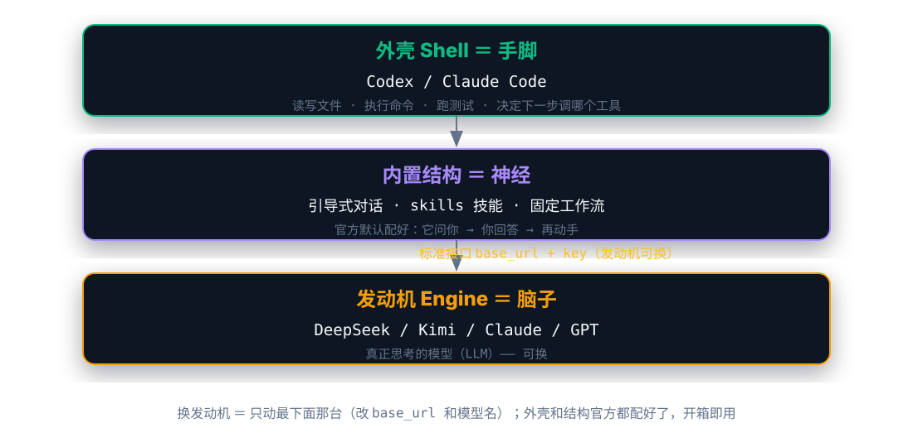

有人看我 Codex 的模型栏里挂着 DeepSeek，就问了一句：这不是 OpenAI 的工具吗，怎么里面跑的是 DeepSeek 的模型？

这个问题问到点子上了。答案一句话就能说清：**Codex 这类工具是「外壳」，里面跑哪个模型是「发动机」，两码事。** 外壳可以原封不动，发动机随便换。

但严格说，「套壳」不是两层，是**三层**：外壳、发动机，还有一层官方早就配好的**内置结构**。手脚和脑子上一篇聊过，这篇把第三层补上，顺便回答另一个问题——**为什么大家愿意用这种「套壳」的东西？**

这篇算上一篇 [《Codex 与 Claude Code：CLI 与 GUI，终端和桌面怎么选》](/blog/codex-claude-code-ai-agents/) 的续——上一篇里我提过「自定义供应商」「baseURL」，但都是一笔带过。这篇就把那层窗户纸捅破，讲清楚为什么能把 DeepSeek 塞进 Codex。

## 壳里其实是三层：手脚、脑子，还有一套结构

以 Codex 为例，它这个「壳」拆开，干活的其实是三部分：

- **外壳（shell）= 手脚**：读写文件、执行命令、跑测试、管理终端、维护上下文、决定下一步调哪个工具。
- **发动机（engine）= 脑子**：真正「动脑子」的那部分——理解你的需求、读懂代码、决定怎么改。这是模型（LLM）在干。
- **内置结构（structure）= 神经**：一套「怎么干活」的逻辑——什么时候该停下来问你、任务按什么流程拆、带哪些 skills（技能）。官方默认把这套结构配好了。

手脚和脑子好懂，真正有意思的是第三层。为什么大家都愿意用 Codex、Claude Code 这种「套壳」工具，而不是直接调裸模型 API？因为**壳里面不是空的**——它内置了一套结构。

## 官方配好的结构：引导式对话和 skills

用 Claude Code 或 Codex 时你肯定发现过：它会先问你问题，你回答，它再动手。这不是模型天生会「提问」，而是官方在默认配置里内置了这套逻辑：

- **引导式对话**：它不闷头猛干，而是会停下来问你「这个文件要不要改？」「方案 A 还是 B？」——你回答，它才继续。
- **skills 技能**：自带一堆「现成的本事」，知道哪种活该用什么套路（社区里流传的 superpowers 技能包，就是这个概念的产物）。
- **固定工作流**：任务怎么拆、先干什么后干什么、什么时候收尾检查，都有默认的剧本。

裸模型 API 是**被动**的：你问一句，它答一句。而 Codex / Claude Code 因为是「套壳」，官方把结构配齐了，它就变成**主动引导你**：它问你、你答、然后动手。这就是「套壳」和「裸 API」的本质区别。

## 对照：PI 里的结构，是我自己配的

拿我自己在用的 PI 说就更直观了。PI 默认没有这套结构——它的「引导式对话」是我自己配出来的：给它写了 ask-user-question 提问工具、配了桌面通知和状态灯、挂了几个 skills 扩展，它才会停下来问我、等我回答（详见 [给 pi 配了提问通知和状态灯，配置也推上了 GitHub](/blog/pi-agent-notifications-status-config/)，当时配「提问通知」本质上就是在补第三层结构）。

而 Claude Code 和 Codex 这两个，**官方配置里已经有了引导式对话**：装上就能「它问你、你回答、然后动手」，不用我从零搭。一句话——**PI 的结构是我自己配的，它们俩的结构是出厂带好的。**

## 为什么发动机能随便换：一层标准接口

为什么 DeepSeek、Kimi、Claude 这些不同家的模型，都能塞进同一个外壳？因为大家约定了**一套差不多的接口**。

现在主流的模型服务基本都是「OpenAI 兼容接口」——不管你是 OpenAI、DeepSeek、Kimi 还是别的，只要给我一个 `base_url` 和一把 API key，我发出去的请求格式就是同一套。外壳只要把请求发到这个 `base_url`，就能把对应模型当发动机用。

所以我常说的「配模型」，本质就两件事：

1. 告诉外壳，发动机的接口在哪（`base_url`）；
2. 告诉外壳，用哪个发动机（模型名 + key）。

这三层里，换发动机只动最下面一层，外壳和结构都原封不动——这也是「Codex 里跑 DeepSeek」的完整答案。

## 上一篇其实已经交代了一半

上一篇讲终端明文配置时，我贴过 `~/.codex/config.toml`，里面就是这套「接线」——准确说是「换发动机」的一半。拿它当例子（做了简化）：

```toml
model_provider = "custom"
model = "deepseek-chat"

[model_providers.custom]
name = "DeepSeek"
base_url = "https://.../v1"   # 发动机接口
```

`model_provider = "custom"` 的意思是：我这个发动机不是官方默认那台，是自定义的。`base_url` 指向哪，发动机就从哪来——指向 DeepSeek 就跑 DeepSeek，换成 Kimi 就跑 Kimi。

所以你看到的「Codex 里跑 DeepSeek」，翻译过来就是：**外壳和结构还是 Codex 的，只有发动机换成了 DeepSeek。**

## 一张图说清楚



从上往下：外壳负责手脚，结构决定「怎么干活」（引导式对话、skills），发动机是底层可换的脑子。换发动机 = 只动最下面那台，其余的官方都配好了。

## 承上启下

把三层套回上一篇，很多东西就全通了：

- **CC Switch / CodeX++** 干的活，就是「帮外壳换发动机」——替你管理不同的 `base_url` 和模型配置。
- 终端里改 `auth.json` / `config.toml`，就是直接手动接线，连工具都不用。
- 上一篇那个「一调推理强度，DeepSeek 变回 GPT」的坑，本质也是：发动机没换利索，外壳一按默认档位，就跳回了官方那台 GPT。
- 而 PI 给 `ask-user-question`、通知、skills，是在给「外壳」补「结构」——官方没配给你的，你得自己配。

带着「三层」这个框架，再看「怎么换发动机」「怎么自己搭结构、搭网关」这些事，就都顺理成章了。下一篇再展开。