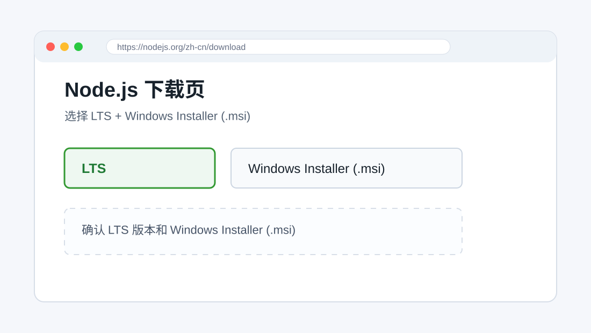
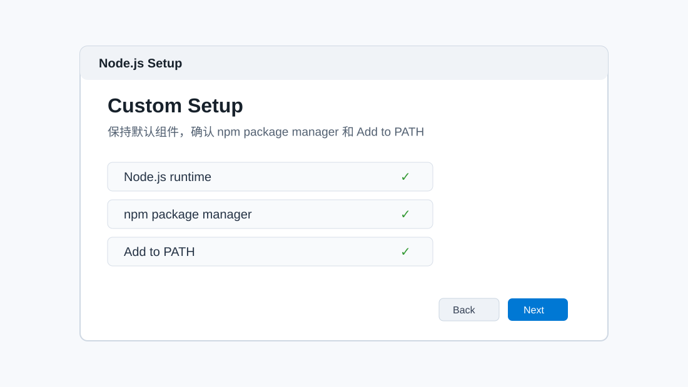
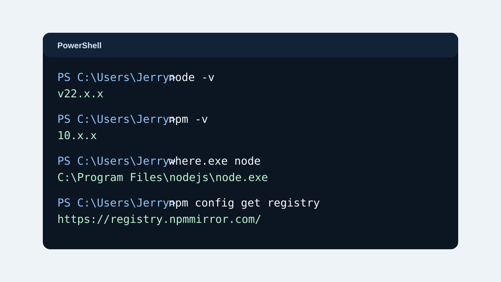
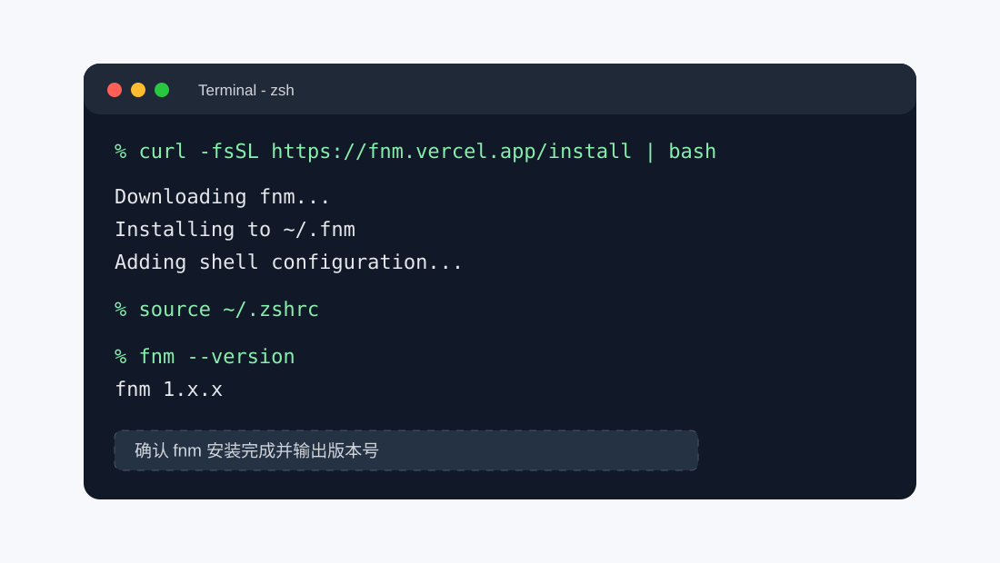
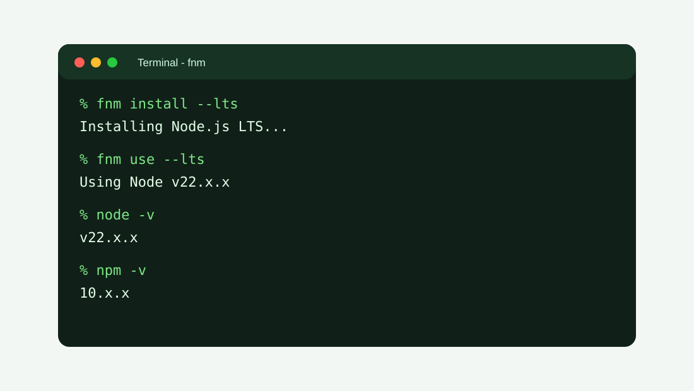
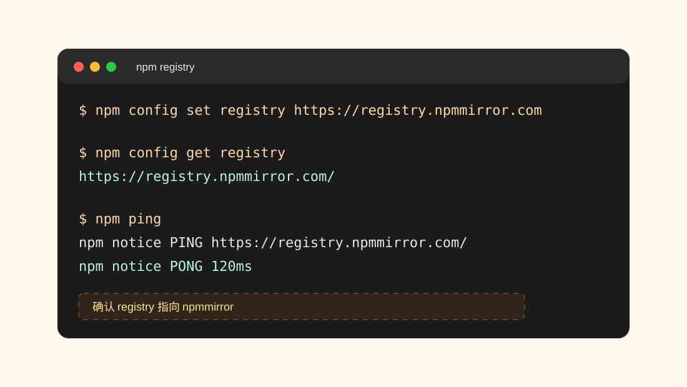

本文记录一套适合新电脑或重装系统后的 Node.js 与 npm 安装流程。Windows 使用官方 MSI 安装包；macOS 使用 fnm 管理 Node.js 版本。npm 会随 Node.js 一起安装，后面再把 registry 配置到 npmmirror，提升国内网络环境下的安装速度。

## 安装目标

- Windows：通过 Node.js 官方 Windows Installer，也就是 `.msi` 安装包安装。
- macOS：先安装 fnm，再用 fnm 安装最新 LTS 版本的 Node.js。
- npm：随 Node.js 一起安装，安装完成后配置为 npmmirror 镜像源。
- 版本选择：优先选择官方页面标记为 `LTS` 的版本，新手不建议直接安装 `Current` 版本。

## 安装前检查

如果电脑里曾经安装过 Node.js，建议先确认当前环境状态。

Windows 打开 PowerShell，执行：

```powershell
node -v
npm -v
where.exe node
where.exe npm
```

macOS 打开终端，执行：

```bash
node -v
npm -v
which node
which npm
```

如果系统提示找不到命令，通常说明当前环境还没有安装 Node.js。如果能看到版本号，说明已经安装过，可以根据实际情况升级、保留或重新安装。

## Windows：使用 MSI 安装 Node.js LTS

### 1. 打开 Node.js 官方下载页

访问 Node.js 官网下载页：

[https://nodejs.org/zh-cn/download](https://nodejs.org/zh-cn/download)

在页面中选择 `LTS` 版本，并选择 `Windows Installer (.msi)`。大多数 Windows 电脑选择 `64-bit` 即可；如果使用的是 Windows on ARM，可以按官网页面选择 ARM64 版本。



### 2. 运行 MSI 安装包

下载完成后，双击 `.msi` 文件开始安装。安装向导中按下面流程操作：

1. 点击 `Next`。
2. 勾选并接受许可协议。
3. 选择安装路径，建议保持默认路径：`C:\Program Files\nodejs\`。
4. 在组件选择页面保持默认配置，确认包含 `Node.js runtime`、`npm package manager`、`Add to PATH`。
5. 如果看到 `Automatically install the necessary tools` 之类的原生编译工具选项，新手可以先不勾选。只有安装某些需要本地编译的 npm 包时，才需要 Visual Studio Build Tools、Python 等工具。
6. 点击 `Install`，等待安装完成。
7. 点击 `Finish` 结束安装。



### 3. 重新打开终端并验证

安装完成后，关闭当前 PowerShell 或 CMD 窗口，重新打开一个新的 PowerShell，然后执行：

```powershell
node -v
npm -v
where.exe node
where.exe npm
```

正常情况下会看到类似下面的结果：

```text
v24.x.x
11.x.x
C:\Program Files\nodejs\node.exe
C:\Program Files\nodejs\npm
C:\Program Files\nodejs\npm.cmd
```

版本号会随着官方 LTS 版本变化而变化，不需要和示例完全一致。只要 `node -v` 和 `npm -v` 都能输出版本号，就说明安装成功。



### 4. Windows 常见问题

如果 PowerShell 提示 `node` 或 `npm` 不是内部或外部命令，通常是环境变量没有生效。可以按下面顺序排查：

1. 关闭所有终端窗口，再重新打开 PowerShell。
2. 如果仍然不行，重启电脑。
3. 检查系统环境变量 `Path` 是否包含 `C:\Program Files\nodejs\`。
4. 检查用户环境变量 `Path` 是否包含 `%AppData%\npm`。
5. 如果之前安装过旧版本 Node.js，建议先在“设置 - 应用”里卸载旧版本，再重新运行官方 MSI 安装包。

## macOS：使用 fnm 安装 Node.js LTS

fnm 是一个快速的 Node.js 版本管理工具，适合在 macOS 上管理多个 Node.js 版本。这里先安装 fnm，再通过 fnm 安装最新 LTS 版本的 Node.js。

### 1. 安装 fnm

打开 macOS 自带的“终端”，执行：

```bash
curl -fsSL https://fnm.vercel.app/install | bash
```

执行完成后，关闭终端并重新打开。macOS 默认一般是 zsh，也可以手动加载配置文件：

```bash
source ~/.zshrc
```

如果使用 bash，则执行：

```bash
source ~/.bashrc
```



### 2. 确认 fnm 是否安装成功

重新打开终端后执行：

```bash
fnm --version
```

如果能看到 fnm 版本号，说明 fnm 已经安装成功。

如果提示 `command not found: fnm`，可以把下面这行追加到 `~/.zshrc`，然后重新加载：

```bash
eval "$(fnm env --use-on-cd --shell zsh)"
```

加载配置：

```bash
source ~/.zshrc
```

如果使用 bash，则把初始化命令写入 `~/.bashrc`：

```bash
eval "$(fnm env --use-on-cd --shell bash)"
```

然后执行：

```bash
source ~/.bashrc
```

### 3. 使用 fnm 安装最新 LTS Node.js

执行下面命令安装最新 LTS 版本：

```bash
fnm install --lts
```

安装完成后切换到 LTS 版本：

```bash
fnm use --lts
```

把当前使用的 LTS 版本设置为默认版本：

```bash
fnm default $(fnm current)
```

最后验证 Node.js 和 npm：

```bash
node -v
npm -v
which node
which npm
```

正常情况下会看到 `node` 和 `npm` 的版本号，并且路径会指向 fnm 管理的目录。



### 4. macOS 下载慢时的可选设置

如果使用 fnm 下载 Node.js 时速度很慢，可以临时指定 Node.js 二进制下载镜像。下面命令只对当前终端这一次安装生效：

```bash
FNM_NODE_DIST_MIRROR=https://npmmirror.com/mirrors/node fnm install --lts
```

如果想长期使用这个镜像，可以把下面配置写入 `~/.zshrc`：

```bash
export FNM_NODE_DIST_MIRROR=https://npmmirror.com/mirrors/node
```

然后执行：

```bash
source ~/.zshrc
```

如果已经成功从官方源下载 Node.js，可以不用配置这一项。

## 配置 npm 镜像源

Node.js 安装完成后，npm 也已经可以使用。国内网络环境下，如果直接访问 npm 官方源速度比较慢，可以把 npm registry 配置为 npmmirror。

Windows PowerShell、CMD、macOS 终端都可以使用同一组命令：

```bash
npm config set registry https://registry.npmmirror.com
npm config get registry
npm ping
```

如果 `npm config get registry` 输出下面地址，说明配置成功：

```text
https://registry.npmmirror.com/
```



以后安装 npm 包时，npm 会优先从这个镜像源拉取包：

```bash
npm install axios
```

如果以后需要恢复官方 npm 源，可以执行：

```bash
npm config set registry https://registry.npmjs.org
```

也可以删除当前 registry 配置，让 npm 回到默认值：

```bash
npm config delete registry
```

查看完整 npm 配置来源：

```bash
npm config list
```

## 关于 npm、npx 和 Corepack

安装 Node.js 后，一般会同时得到下面几个命令：

- `node`：Node.js 运行时。
- `npm`：Node.js 默认包管理器。
- `npx`：临时执行 npm 包命令的工具，通常随 npm 一起安装。
- `corepack`：用于启用和管理 pnpm、Yarn 等包管理器的工具，新版 Node.js 通常会自带。

本文只要求安装 Node.js 和 npm，因此不需要额外安装 pnpm 或 Yarn。如果项目文档要求使用 pnpm，可以后续再单独配置。

## 最终检查清单

Windows 检查：

```powershell
node -v
npm -v
where.exe node
where.exe npm
npm config get registry
```

macOS 检查：

```bash
fnm --version
node -v
npm -v
which node
which npm
npm config get registry
```

确认下面几件事：

1. `node -v` 能输出版本号。
2. `npm -v` 能输出版本号。
3. Node.js 版本来自官方最新 LTS 分支。
4. Windows 的 Node.js 来自 MSI 安装包。
5. macOS 的 Node.js 由 fnm 管理。
6. `npm config get registry` 输出 `https://registry.npmmirror.com/`。
